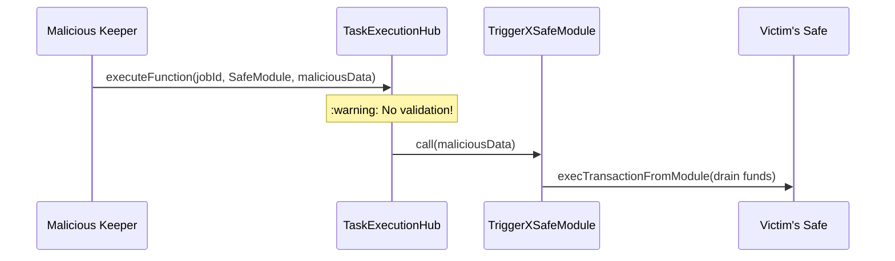
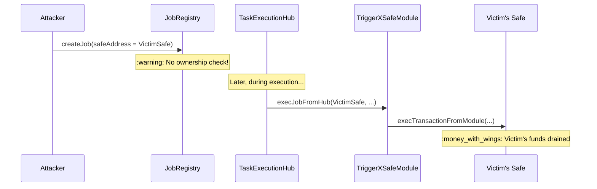
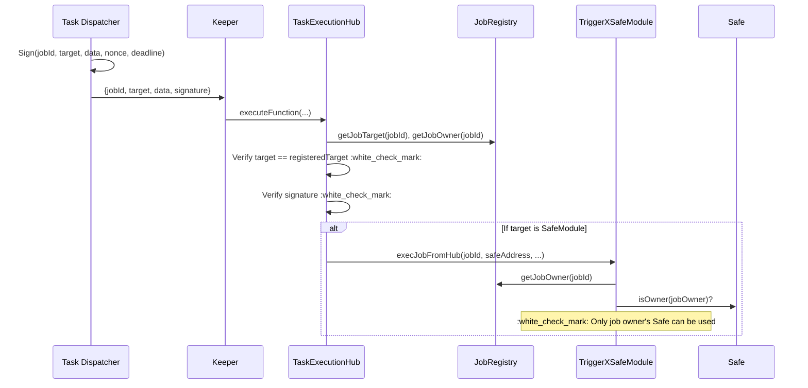

# TriggerX Security Upgrade

## Executive Summary

This document outlines security improvements for TriggerX's task execution system, addressing multiple attack vectors including malicious keepers and Safe module abuse.

---

## Vulnerabilities Identified

### Vulnerability 1: Keeper Can Execute Arbitrary Target

`TaskExecutionHub.executeFunction()` accepts **any** `target` and `calldata` from keepers.



### Vulnerability 2: Safe Address Spoofing (CRITICAL)

**Current Issue**: User A creates a job with User B's Safe address in metadata.



**Root Cause**: Neither `JobRegistry` nor `TriggerXSafeModule` verifies that the Safe belongs to the job creator.

---

## Proposed Architecture (Secure)



---

## Security Layers

| Layer | Protection | Attack Blocked |
|-------|------------|----------------|
| **Target Validation** | `target == jobRegistry.getTarget(jobId)` | Wrong contract |
| **Signature Verification** | Dispatcher signs execution | Unauthorized calldata |
| **Nonce** | Sequential counter | Replay attacks |
| **Deadline** | Signature expiration | Stale execution |
| **Keeper Binding** | `msg.sender` in signature | Front-running |
| **Chain ID** | `block.chainid` in signature | Cross-chain replay |
| **Safe Ownership** | Module verifies Safe owner == jobOwner | Safe spoofing |

---

## Contract Changes

### JobRegistry.sol

```diff
struct Job {
    uint256 jobId;
    address jobOwner;
    bytes32 jobHash;
    uint256 lastUpdatedAt;
    bool isActive;
+   address targetContract;  // Execution target
}

+ function getJobTarget(uint256 jobId) external view returns (address);
```

### TaskExecutionHub.sol

```diff
+ address public dispatcher;
+ mapping(uint256 => uint256) public executionNonce;

function executeFunction(
    uint256 jobId,
    uint256 ethAmount,
    address target,
    bytes calldata data,
+   uint256 nonce,
+   uint256 deadline,
+   bytes calldata signature
) external payable onlyKeeper nonReentrant {
+   // 1. Deadline check
+   require(block.timestamp <= deadline, "Expired");

    // 2. Chain check
    (uint256 chainId,) = jobRegistry.unpackJobId(jobId);
    require(chainId == block.chainid, "Wrong chain");

+   // 3. Target validation
+   require(target == jobRegistry.getJobTarget(jobId), "Target mismatch");

    // 4. Job active check
    require(jobRegistry.isJobActive(jobId), "Inactive");

+   // 5. Nonce check (replay protection)
+   require(nonce == executionNonce[jobId], "Invalid nonce");
+   executionNonce[jobId]++;

+   // 6. Signature verification
+   bytes32 hash = keccak256(abi.encode(
+       jobId, target, keccak256(data), nonce, deadline, msg.sender, block.chainid
+   ));
+   require(
+       ECDSA.recover(ECDSA.toEthSignedMessageHash(hash), signature) == dispatcher,
+       "Invalid signature"
+   );

    // 7. Execute
    address jobOwner = jobRegistry.getJobOwner(jobId);
    triggerGasRegistry.deductETHBalance(jobOwner, ethAmount);
    _executeFunction(target, data);
}

+ function setDispatcher(address _dispatcher) external onlyOwner;
```

### TriggerXSafeModule.sol (CRITICAL FIX)

```diff
+ IJobRegistry public jobRegistry;

function execJobFromHub(
+   uint256 jobId,           // NEW: For ownership verification
    address safeAddress,
    address actionTarget,
    uint256 actionValue,
    bytes calldata actionData,
    uint8 operation
) external nonReentrant onlyHub returns (bool success) {

+   // CRITICAL: Verify Safe belongs to job owner
+   address jobOwner = jobRegistry.getJobOwner(jobId);
+   IGnosisSafe safe = IGnosisSafe(safeAddress);
+   require(safe.isOwner(jobOwner), "Safe not owned by job owner");

    bool ok;
    try safe.execTransactionFromModule(actionTarget, actionValue, actionData, operation) returns (bool _success) {
        ok = _success;
    } catch {
        ok = false;
    }

    // ... rest unchanged
}

+ function setJobRegistry(address _registry) external onlyOwner;
```

---

## Backend Changes

### Task Dispatcher Signing

```go
func (d *TaskDispatcher) SignExecution(
    jobId *big.Int,
    target common.Address,
    data []byte,
    nonce *big.Int,
    deadline *big.Int,
    keeperAddress common.Address,
    chainId *big.Int,
) ([]byte, error) {
    hash := crypto.Keccak256(
        abi.Encode(jobId, target, crypto.Keccak256(data), nonce, deadline, keeperAddress, chainId),
    )

    ethSignedHash := accounts.TextHash(hash)
    signature, err := crypto.Sign(ethSignedHash, d.privateKey)
    if err != nil {
        return nil, err
    }

    signature[64] += 27  // Fix v value
    return signature, nil
}
```

---

## Attack Vector Mitigations

| Attack | Mitigation |
|--------|------------|
| **Signature Replay** | Nonce increments after each execution |
| **Front-Running** | `msg.sender` in signature hash |
| **Cross-Chain Replay** | `block.chainid` in signature |
| **Stale Execution** | Deadline check |
| **Safe Spoofing** | Module verifies `safe.isOwner(jobOwner)` |
| **Dispatcher Compromise** | HSM, multi-sig rotation, rate limiting |

---

## Edge Case: Last-Second Execution

**Concern**: Job triggers at 23:59:59, tx lands at 00:00:01 after deadline.

**Solution**: Use signature deadline (not job expiry).
- Backend stops signing before job expires
- Signature has +5 minute buffer
- Contract checks signature deadline only

---

## Per-Job Dispatcher (Overkill for Now)

Each job could have its own authorized signer:

```solidity
struct Job {
    ...
    address authorizedSigner; // If 0x0, use global
}
```

**Verdict**: Overkill for current scale.
- Global dispatcher with HSM is sufficient
- Add later for enterprise/B2B clients

---

## TaskDefinitionID Reference

| ID | Type | Target Source | Calldata Source |
|----|------|---------------|-----------------|
| 1 | Time + Static | DB | DB |
| 2 | Time + Dynamic | DB | IPFS script |
| 3 | Event + Static | DB | DB |
| 4 | Event + Dynamic | DB | IPFS script |
| 5 | Condition + Static | DB | DB |
| 6 | Condition + Dynamic | DB | IPFS script |
| 7 | Custom Script | Script output | Script output |

---

## Implementation Checklist

- [ ] `JobRegistry.sol` - Add `targetContract` field + getter
- [ ] `TaskExecutionHub.sol` - Add validation + signature verification
- [ ] `TriggerXSafeModule.sol` - Add `jobId` param + ownership check
- [ ] Backend: Add signing logic to Task Dispatcher
- [ ] Backend: Update Keeper execution with signature
- [ ] Deploy to testnet
- [ ] Security audit
- [ ] Deploy to mainnet (upgrade proxies)

---

## Migration Strategy

Since contracts are already deployed:

1. Deploy new implementations
2. Upgrade proxies via `upgradeToAndCall`
3. Legacy jobs (`targetContract == 0x0`):
   - Signature still required
   - Grace period logging

```solidity
if (registeredTarget == address(0)) {
    emit LegacyJobExecuted(jobId);
} else {
    require(target == registeredTarget, "Target mismatch");
}
```