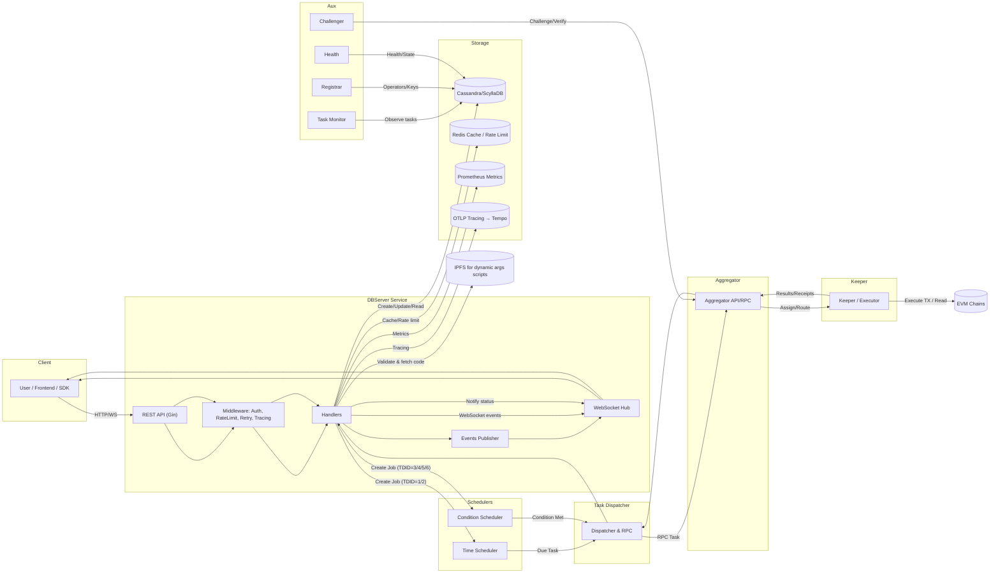

### TriggerX Backend — End-to-End Data Flow

This document shows how data flows across services from API calls to database writes, scheduling, dispatch, aggregation, and keeper execution. It also calls out supporting concerns like Redis, WebSockets, tracing, metrics, and external integrations.

#### High-level System Data Flow



#### Job Lifecycle (Create → Schedule → Dispatch → Execute)

```mermaid
sequenceDiagram
  autonumber
  participant User as Client
  participant API as DBServer API
  participant Repo as DB Repositories
  participant DB as Cassandra/ScyllaDB
  participant IPFS as IPFS
  participant SCHED as Scheduler (Time/Condition)
  participant TD as Task Dispatcher
  participant AGG as Aggregator
  participant KPR as Keeper
  participant CHAIN as EVM Chain

  User->>API: POST /api/jobs (CreateJobData[])
  API->>API: Validate JSON, Auth, RateLimit, Trace
  alt Dynamic args script provided
    API->>IPFS: GET script
    IPFS-->>API: Code
    API->>API: Validate code & (optional) SafeAddress match
  end
  API->>Repo: Create/Upsert User, SafeAddress
  Repo->>DB: INSERT/UPDATE users, safe_addresses
  API->>Repo: INSERT job(s) + time/event/condition rows
  Repo->>DB: INSERT jobs, time_jobs/event_jobs/condition_jobs

  note over API,SCHED: For TDID 1/2 → Time; 3/4/5/6 → Condition/Event
  API-->>SCHED: Notify new job (schedule payload)

  SCHED->>DB: Persist scheduler state, next run
  SCHED-->>TD: Enqueue due/triggered task
  TD->>AGG: RPC dispatch task
  AGG->>KPR: Assign task to keeper(s)
  KPR->>CHAIN: Execute on-chain call/tx
  CHAIN-->>KPR: Receipt/Result
  KPR-->>AGG: Execution outcome
  AGG-->>TD: Aggregated result
  TD->>Repo: Update task/job status
  Repo->>DB: UPDATE tasks/jobs
  API-->>User: WebSocket event with status update
```

### Job Lifecycle — Fields Used by Each Service

This maps the fields from `internal/dbserver/types/job_types.go` (CreateJobData) and the derived job models used down the pipeline.

#### Legend
- Required means the stage fails without it. Optional means supported if present. Derived means computed/stored from inputs.
- TDID stands for `task_definition_id`.

#### 1) DBServer API (CreateJobData request)

| Category | Field | Use | Notes |
|---|---|---|---|
| Identity | `job_id` | required | Parsed to big.Int; primary key for all downstream entities |
| User | `user_address` | required | Lowercased; used to upsert user, relate jobs |
| User | `ether_balance`, `token_balance` | required | Stored in user if user created |
| Meta | `job_title` | required | Stored on job |
| Routing | `task_definition_id` | required | Determines scheduler: 1/2→time, 3/4→event, 5/6→condition |
| Meta | `custom` | optional | Affects user points (+10/20) |
| Meta | `language` | optional | For IPFS code validation |
| SLA | `time_frame` | required | Expiration window stored on job |
| SLA | `recurring` | optional | Used by schedulers |
| Cost | `job_cost_prediction` | required | Stored on job |
| Timezone | `timezone` | required | Stored on job |
| Chain Origin | `created_chain_id` | required | Stored on job (origin chain context) |
| Safe | `is_safe` | optional | If true, `safe_address` is required |
| Safe | `safe_address`, `safe_name` | conditional | Safe registry per user and stored on job |
| Time | `schedule_type`, `time_interval`, `cron_expression`, `specific_schedule` | conditional | Required for TDID 1/2 depending on schedule type |
| Event | `trigger_chain_id`, `trigger_contract_address`, `trigger_event`, `event_filter_para_name`, `event_filter_value` | conditional | Required for TDID 3/4; filters optional |
| Condition | `condition_type`, `upper_limit`, `lower_limit`, `value_source_type`, `value_source_url`, `selected_key_route` | conditional | Required for TDID 5/6 by chosen condition |
| Target | `target_chain_id`, `target_contract_address`, `target_function`, `abi`, `arg_type`, `arguments` | required | Invocation target for all TDIDs |
| Dynamic Args | `dynamic_arguments_script_url` | optional | If present for TDID 2/4/6, fetched/validated from IPFS |
| Flags | `is_imua` | optional | Marks IMUA jobs |

Derived and persistence at this stage:
- Creates/updates user, safe address, and `jobs` row. Writes to `time_jobs` (TDID 1/2), `event_jobs` (TDID 3/4), or `condition_jobs` (TDID 5/6).
- For `dynamic_arguments_script_url` with supported TDIDs, downloads code from IPFS and validates executability and Safe match before persisting.

#### 2) Schedulers (Time / Event / Condition)

Common inputs across schedulers:
- Identity: `job_id` (required)
- Routing: `task_definition_id` (required)
- SLA: `expiration_time` (derived), `recurring` (optional)
- Target invocation (required): `target_chain_id`, `target_contract_address`, `target_function`, `abi`, `arg_type`, `arguments` or `dynamic_arguments_script_url`
- Safe: `is_safe`, `safe_address` (conditional)

Time Scheduler (TDID 1/2):
- Requires one of: `time_interval` (interval), `cron_expression` (cron), or `specific_schedule`
- Maintains `next_execution_timestamp` (derived)

Event Scheduler (TDID 3/4):
- Requires: `trigger_chain_id`, `trigger_contract_address`, `trigger_event`
- Optional filter: `event_filter_para_name`, `event_filter_value`

Condition Scheduler (TDID 5/6):
- Requires: `condition_type` and threshold(s) (`upper_limit`/`lower_limit`) OR external source (`value_source_type`, `value_source_url`), optionally `selected_key_route`

Outputs to Dispatcher:
- A task envelope containing identity, target invocation details, scheduling metadata (due/triggered time), and safe context.

#### 3) Task Dispatcher

Consumes scheduler task envelope. Required fields:
- `job_id`, `task_definition_id`
- Target invocation: `target_chain_id`, `target_contract_address`, `target_function`, `abi`, `arg_type`, `arguments` or `dynamic_arguments_script_url`
- Safe context: `is_safe`, `safe_address` (if applicable)
- Execution constraints: due time, retry policy (internal)

Produces:
- RPC call to Aggregator with the above payload, plus dispatcher metadata (trace id, attempt, priority)

#### 4) Aggregator

Consumes dispatcher RPC. Required fields:
- `job_id`, `task_definition_id`
- Target invocation (same as above)
- Safe context if applicable

Performs:
- Keeper assignment/selection; may use operator/keeper registry data
- Returns execution request to Keeper with full invocation data

#### 5) Keeper (Executor)

Consumes aggregator assignment. Required fields:
- `target_chain_id`, `target_contract_address`, `target_function`, `abi`
- One of: `arguments` (static) OR `dynamic_arguments_script_url` (Keeper or prior service must evaluate to arguments)
- If `is_safe=true`: `safe_address` must be provided and used for Safe transaction flow

Produces:
- On-chain transaction or call on `target_chain_id`; returns transaction hash/receipt or call result
- Sends outcome back to Aggregator → Dispatcher → DB updates

#### 6) DB Updates and Notifications

Fields updated post-execution:
- Task status, job status, last executed timestamp, receipts/result metadata
- WebSocket events to clients contain: `job_id`, task status, error info (if any), result/receipt pointers

### Field Flow Summary by TDID

```mermaid
flowchart TB
  subgraph Common
    A[job_id, user_address, job_title, task_definition_id]
    B[target_chain_id, target_contract_address, target_function, abi, arg_type]
    C[arguments or dynamic_arguments_script_url]
    S[is_safe, safe_address]
  end

  subgraph Time[TDID 1/2]
    T[time_interval or cron_expression or specific_schedule]
  end

  subgraph Event[TDID 3/4]
    E[trigger_chain_id, trigger_contract_address, trigger_event]
    F[(event_filter_para_name, event_filter_value) optional]
  end

  subgraph Condition[TDID 5/6]
    G[condition_type, upper_limit/lower_limit]
    H[(value_source_type, value_source_url, selected_key_route) optional]
  end

  A --> B --> C --> S
  A --> T
  A --> E --> F
  A --> G --> H
```

### How to Introduce a New Field Safely

Use this checklist when adding a field that should flow through the system.

1) Define types and validation
- Update `internal/dbserver/types/job_types.go` (e.g., `CreateJobData`) with the new JSON field, add `validate:"..."` tags as needed.
- If the field persists beyond request scope, add to corresponding persisted models in `pkg/types` or repository layer DTOs.
- Update/request validators in `internal/dbserver/middleware` if there are custom rules.

2) Persist and migrate
- Update repositories under `internal/dbserver/repository/**` to read/write the field.
- Add/adjust CQL migrations under `internal/dbserver/migrations` and any seed/init scripts under `scripts/database/**`.
- Backfill or default handling for existing rows if required.

3) Use in handlers
- Update handlers (e.g., `internal/dbserver/handlers/job_create.go`) to accept, validate, and persist the field.
- If the field affects routing (e.g., new schedule type), branch logic must be added accordingly.

4) Propagate to schedulers
- Extend scheduler payloads and readers in `internal/schedulers/**` to include the new field when needed.
- For time/event/condition logic, integrate the field into trigger conditions or scheduling computation.

5) Propagate to dispatcher/aggregator/keeper
- Update task payload structs and RPC messages in `internal/taskdispatcher/**` and `internal/aggregator/**`.
- Make Keeper read and act on the field in `internal/keeper/**` (or `internal/imua-keeper/**`).

6) Telemetry and docs
- Expose metrics and tracing attributes where helpful.
- Update `docs/data-flow.md` (this file) to reflect the new field’s lifecycle.
- If exposed to clients, update API docs and WebSocket event schemas.

7) Tests and rollout
- Add/modify unit tests around validation, persistence, and service behavior.
- Consider versioning or feature flags if the field changes behavior across services.

#### Key Data Entities
- Jobs: created by `DBServer` (handlers), stored in `jobs` plus specific tables `time_jobs`, `event_jobs`, `condition_jobs`.
- Users: created/updated on job creation; points updated; job IDs appended.
- Safe Addresses: tracked per user if `is_safe=true`.
- Tasks: created by schedulers/dispatcher; status updates written back to DB.

#### Service Responsibilities
- DBServer: REST API, validation, IPFS code fetch/validation, repositories, WebSocket hub, tracing, metrics, Redis rate limits/cache.
- Schedulers: time-based and condition/event-based triggers; enqueue to dispatcher.
- Task Dispatcher: routes tasks to Aggregator via RPC; manages retries/metrics.
- Aggregator: assigns to Keeper(s), aggregates results, orchestrates execution.
- Keeper: performs on-chain execution and returns results.
- Registrar: manages operator/keeper registration and related state.
- Task Monitor: observes tasks, health, emits events/alerts.
- Challenger: validates/verifies executions when applicable.
- Health: service health/state management.

#### Supporting Flows
- Redis: rate limiting and any caching used by handlers and WebSockets.
- WebSockets: live push of job/task status to clients via hub.
- Metrics: Prometheus endpoint `/metrics` exposed by DBServer; other services export their metrics too.
- Tracing: OTLP exported to Tempo; trace IDs propagated via `X-Trace-ID` header.
- IPFS: dynamic arguments scripts downloaded and validated before job persists/schedules.

#### Notes
- Time vs Condition/Event routing is driven by `task_definition_id`.
- Safe wallet jobs record and validate `safe_address` and can be filtered/queried by it.
- The diagram reflects observed code paths in `internal/dbserver/server.go`, `internal/dbserver/handlers/job_create.go`, and other service entrypoints under `cmd/` and `internal/`.


