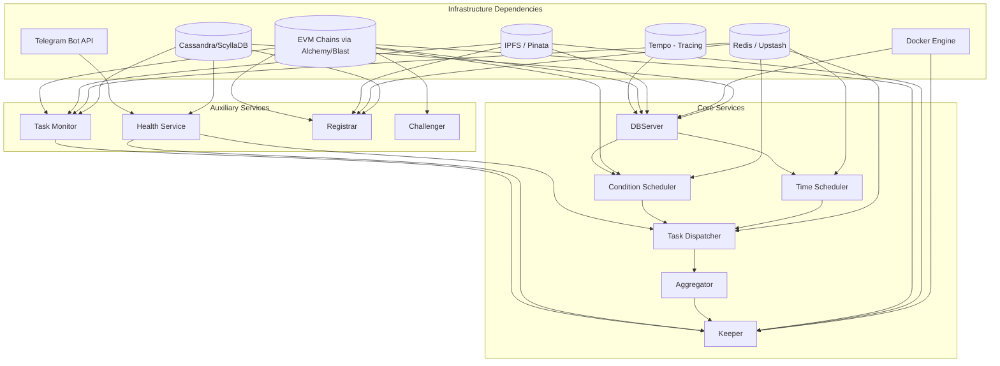
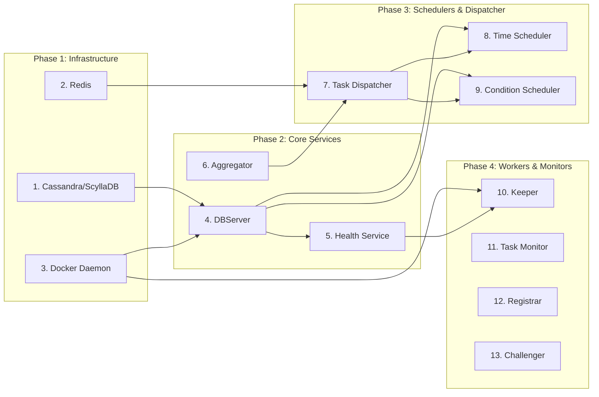

# TriggerX Backend — Service Dependencies Analysis

This document analyzes the dependencies for each service and step in the TriggerX backend project, based on the data flow described in [data-flow.md](./data-flow.md).

---

## Executive Summary

The TriggerX backend consists of **10 core services** that work together to enable automated job scheduling and execution on EVM chains. Each service depends on a combination of:

1. **Infrastructure Services** — Cassandra/ScyllaDB, Redis, IPFS, Docker
2. **External APIs** — EVM Chain RPCs, Etherscan, Telegram
3. **Internal Services** — Other TriggerX microservices

---

## High-Level Dependency Graph



---

## Service-by-Service Dependencies

### 1. DBServer (API Gateway)

**Location:** `cmd/dbserver/main.go`

The DBServer is the primary API gateway that handles all client requests, job creation, and data persistence.

| Dependency | Type | Required | Purpose |
|------------|------|----------|---------|
| **Cassandra/ScyllaDB** | Infrastructure | ✅ Required | Primary data store for jobs, users, tasks |
| **Docker Engine** | Infrastructure | ⚠️ Optional | Code validation for dynamic argument scripts |
| **IPFS (Pinata)** | External API | ⚠️ Optional | Fetch dynamic argument scripts (TDID 2/4/6) |
| **EVM RPC (Alchemy)** | External API | ✅ Required | Gas estimation for task fees, fund claiming |
| **Redis** | Infrastructure | ⚠️ Optional | Caching code validation results, rate limiting |
| **Tempo (OTLP)** | Infrastructure | ⚠️ Optional | Distributed tracing |

> **Important:** DBServer requires EVM RPC access for:
> - `CalculateTaskFees` - Gas estimation using Alchemy RPC
> - `ClaimFunds` - On-chain transaction for fund claims
> - `ValidateCode` - Gas estimation during code validation

**Startup Dependencies:**
```
1. Cassandra/ScyllaDB must be running
2. Docker daemon must be running (for code validation)
3. EVM RPC endpoints must be accessible (Alchemy/Blast)
```

**Key Environment Variables:**
```bash
DATABASE_HOST_ADDRESS=localhost
DATABASE_HOST_PORT=9042
ALCHEMY_API_KEY=...
L1_RPC=https://eth-holesky.g.alchemy.com/v2/
L2_RPC=https://base-sepolia.g.alchemy.com/v2/
```

---

### 2. Time Scheduler (TDID 1/2)

**Location:** `cmd/schedulers/time/main.go`

Handles time-based job scheduling using intervals, cron expressions, or specific schedules.

| Dependency | Type | Required | Purpose |
|------------|------|----------|---------|
| **DBServer** | Internal Service | ✅ Required | Fetch time-based jobs, update job status |
| **Task Dispatcher (RPC)** | Internal Service | ✅ Required | Submit due tasks for execution |

**Startup Dependencies:**
```
1. DBServer must be running and healthy
2. Task Dispatcher must be available for RPC calls
```

**Key Environment Variables:**
```bash
DATABASE_RPC_URL=http://localhost:9002
TASK_DISPATCHER_RPC_URL=...
TIME_SCHEDULER_POLLING_INTERVAL=30s
```

---

### 3. Condition Scheduler (TDID 3/4/5/6)

**Location:** `cmd/schedulers/condition/main.go`

Handles event-based and condition-based job scheduling.

| Dependency | Type | Required | Purpose |
|------------|------|----------|---------|
| **DBServer** | Internal Service | ✅ Required | Fetch condition/event jobs, update status |
| **Redis** | Infrastructure | ✅ Required | Job streams, condition state caching |
| **EVM RPC (Alchemy)** | External API | ✅ Required | Event monitoring, condition value fetching |
| **Task Dispatcher (RPC)** | Internal Service | ✅ Required | Submit triggered tasks for execution |

> **Important:** Condition Scheduler connects to multiple EVM chains for:
> - **Event Workers (TDID 3/4)** - Subscribe to contract events via WebSocket/Polling
> - **Condition Workers (TDID 5/6)** - Fetch on-chain values for condition evaluation

**Startup Dependencies:**
```
1. DBServer must be running and healthy
2. Redis must be running (for job creation streams)
3. EVM RPC endpoints must be accessible (for event monitoring)
4. Task Dispatcher must be available for RPC calls
```

**Key Environment Variables:**
```bash
DATABASE_RPC_URL=http://localhost:9002
TASK_DISPATCHER_RPC_URL=...
UPSTASH_REDIS_URL=...
ALCHEMY_API_KEY=...
```

---

### 4. Task Dispatcher

**Location:** `cmd/taskdispatcher/main.go`

Routes tasks from schedulers to the Aggregator for execution.

| Dependency | Type | Required | Purpose |
|------------|------|----------|---------|
| **Redis** | Infrastructure | ✅ Required | Task streams, orchestration |
| **Aggregator** | Internal Service | ✅ Required | RPC dispatch of tasks |
| **Health Service** | Internal Service | ⚠️ Optional | Check keeper availability |

**Startup Dependencies:**
```
1. Redis must be running
2. Aggregator must be running (for RPC dispatch)
3. Health Service should be available (for keeper routing)
```

**Key Environment Variables:**
```bash
UPSTASH_REDIS_URL=...
AGGREGATOR_RPC_URL=http://localhost:9001
HEALTH_RPC_URL=http://localhost:9004
```

---

### 5. Aggregator

**Location:** `cmd/aggregator/main.go`

Manages task assignment to keepers and aggregates execution results.

| Dependency | Type | Required | Purpose |
|------------|------|----------|---------|
| **(No external infrastructure)** | - | - | In-memory task and operator management |

**Startup Dependencies:**
```
1. No infrastructure dependencies
2. Keepers should register after Aggregator starts
```

> **Note:** The Aggregator is relatively self-contained and manages operators/tasks in-memory. It can start independently.

---

### 6. Keeper (Executor)

**Location:** `cmd/keeper/main.go`

Executes on-chain transactions and runs dynamic argument scripts.

| Dependency | Type | Required | Purpose |
|------------|------|----------|---------|
| **Health Service** | Internal Service | ✅ Required | Initial check-in, periodic health reports |
| **Aggregator** | Internal Service | ✅ Required | Report execution results |
| **Docker Engine** | Infrastructure | ✅ Required | Execute dynamic argument scripts |
| **IPFS (Pinata)** | External API | ✅ Required | Fetch script code |
| **EVM Chains (Alchemy)** | External API | ✅ Required | Execute on-chain transactions |
| **Task Monitor** | Internal Service | ⚠️ Optional | Report task errors |

**Startup Dependencies:**
```
1. Health Service must be running (first check-in required)
2. Aggregator must be running (for result submission)
3. Docker daemon must be running
4. IPFS gateway must be accessible
5. EVM RPC endpoints must be accessible
```

**Key Environment Variables:**
```bash
HEALTH_RPC_URL=http://localhost:9004
AGGREGATOR_RPC_URL=http://localhost:9001
IPFS_HOST=...
PINATA_JWT=...
ALCHEMY_API_KEY=...
PRIVATE_KEY=...
```

---

### 7. Health Service

**Location:** `cmd/health/main.go`

Manages keeper health tracking and notifications.

| Dependency | Type | Required | Purpose |
|------------|------|----------|---------|
| **Cassandra/ScyllaDB** | Infrastructure | ✅ Required | Store keeper state, verified keepers |
| **Telegram Bot API** | External API | ⚠️ Optional | Send alerts/notifications |

**Startup Dependencies:**
```
1. Cassandra/ScyllaDB must be running
```

**Key Environment Variables:**
```bash
DATABASE_HOST_ADDRESS=localhost
DATABASE_HOST_PORT=9042
BOT_TOKEN=...
```

---

### 8. Task Monitor

**Location:** `cmd/taskmonitor/main.go`

Monitors task execution and listens for contract events.

| Dependency | Type | Required | Purpose |
|------------|------|----------|---------|
| **Redis** | Infrastructure | ✅ Required | Task streams, state management |
| **Cassandra/ScyllaDB** | Infrastructure | ✅ Required | Task status updates |
| **IPFS (Pinata)** | External API | ✅ Required | Fetch job metadata |
| **EVM Chains (Alchemy)** | External API | ✅ Required | Listen for contract events |

**Startup Dependencies:**
```
1. Redis must be running
2. Cassandra/ScyllaDB must be running
3. EVM RPC endpoints must be accessible
```

---

### 9. Registrar

**Location:** `cmd/registrar/main.go`

Manages operator/keeper registration and rewards.

| Dependency | Type | Required | Purpose |
|------------|------|----------|---------|
| **Redis** | Infrastructure | ✅ Required | State management, block tracking |
| **Cassandra/ScyllaDB** | Infrastructure | ✅ Required | Operator data persistence |
| **IPFS (Pinata)** | External API | ✅ Required | Operator metadata |
| **EVM Chains (Alchemy)** | External API | ✅ Required | Listen for registration events |

**Startup Dependencies:**
```
1. Redis must be running
2. Cassandra/ScyllaDB must be running
3. EVM RPC endpoints must be accessible
```

---

### 10. Challenger

**Location:** `cmd/challenger/main.go`

Validates/challenges task executions for fraud proofs.

| Dependency | Type | Required | Purpose |
|------------|------|----------|---------|
| **EVM Chains (Alchemy)** | External API | ✅ Required | Monitor task events, submit challenges |

**Startup Dependencies:**
```
1. EVM RPC endpoints must be accessible
```

---

## Recommended Startup Order

Based on the dependency analysis, here is the recommended order to start services:



### Startup Script Example

```bash
#!/bin/bash

# Phase 1: Infrastructure
echo "Starting infrastructure..."
docker-compose up -d scylla redis
sleep 30  # Wait for ScyllaDB to be ready

# Phase 2: Core Services
echo "Starting core services..."
./dbserver &
sleep 5
./health &
./aggregator &
sleep 5

# Phase 3: Schedulers & Dispatcher
echo "Starting schedulers..."
./taskdispatcher &
./time-scheduler &
./condition-scheduler &
sleep 5

# Phase 4: Workers & Monitors
echo "Starting workers..."
./keeper &
./taskmonitor &
./registrar &
./challenger &

echo "All services started!"
```

---

## Quick Reference: Service → Dependencies

| Service | Cassandra | Redis | Docker | IPFS | EVM RPC | Other Services |
|---------|:---------:|:-----:|:------:|:----:|:-------:|----------------|
| DBServer | ✅ | ⚠️ | ⚠️ | ⚠️ | ✅ | - |
| Time Scheduler | - | - | - | - | - | DBServer, TaskDispatcher |
| Condition Scheduler | - | ✅ | - | - | ✅ | DBServer, TaskDispatcher |
| Task Dispatcher | - | ✅ | - | - | - | Aggregator, Health |
| Aggregator | - | - | - | - | - | - |
| Keeper | - | - | ✅ | ✅ | ✅ | Health, Aggregator, TaskMonitor |
| Health | ✅ | - | - | - | - | Telegram |
| Task Monitor | ✅ | ✅ | - | ✅ | ✅ | - |
| Registrar | ✅ | ✅ | - | ✅ | ✅ | - |
| Challenger | - | - | - | - | ✅ | - |

**Legend:** ✅ = Required, ⚠️ = Optional/Conditional, - = Not Used

---

## EVM RPC/Alchemy Usage by Service

| Service | RPC Usage | Chains |
|---------|-----------|--------|
| **DBServer** | Gas estimation (`eth_estimateGas`), Fund claims | Target chains (configurable) |
| **Condition Scheduler** | Event subscription (`eth_subscribe`), Log polling (`eth_getLogs`), State reads (`eth_call`) | Trigger chains (L1: Holesky, L2: Base Sepolia) |
| **Keeper** | Transaction execution (`eth_sendRawTransaction`), Receipt polling, Gas estimation | Target chains (all supported) |
| **Task Monitor** | Event listening for task completion | L1/L2 attestation chains |
| **Registrar** | Operator registration events, Rewards distribution | L1 (Holesky), L2 (Base Sepolia) |
| **Challenger** | Task event monitoring, Challenge submissions | Attestation chain |

---

## External API Dependencies Summary

| External Service | Used By | Purpose |
|------------------|---------|---------|
| **Alchemy RPC** | DBServer, Condition Scheduler, Keeper, TaskMonitor, Registrar, Challenger | EVM chain interactions |
| **Blast RPC** | (Alternative to Alchemy) | EVM chain interactions |
| **Pinata/IPFS** | DBServer, Keeper, TaskMonitor, Registrar | Script storage and retrieval |
| **Etherscan** | Keeper | Contract ABI fetching, gas estimation |
| **Telegram** | Health Service | Alert notifications |
| **Upstash Redis** | Condition Scheduler, TaskDispatcher, TaskMonitor, Registrar | Cloud Redis alternative |

---

## Configuration Checklist

Before starting the system, ensure these are configured:

### Infrastructure
- [ ] Cassandra/ScyllaDB running on `DATABASE_HOST_ADDRESS:DATABASE_HOST_PORT`
- [ ] Redis running (local or Upstash cloud)
- [ ] Docker daemon running

### External APIs
- [ ] `ALCHEMY_API_KEY` configured for EVM chain access
- [ ] `PINATA_JWT` and `IPFS_HOST` configured for IPFS access
- [ ] `ETHERSCAN_API_KEY` configured for ABI/gas estimation
- [ ] `BOT_TOKEN` configured for Telegram notifications (optional)

### Internal Service URLs
- [ ] `DATABASE_RPC_URL` pointing to DBServer
- [ ] `AGGREGATOR_RPC_URL` pointing to Aggregator
- [ ] `HEALTH_RPC_URL` pointing to Health Service
- [ ] `TASK_DISPATCHER_RPC_URL` pointing to Task Dispatcher

---

*Generated from analysis of [triggerx-backend](https://github.com/trigg3rX/triggerx-backend) project structure*
