# Task Flow Tracing — Design and Implementation Guide

This document describes the end-to-end trace flow for task execution across the TriggerX backend services, from scheduler creation through aggregator validation and taskmonitor database updates.

## Overview

The task flow trace follows a task from its earliest point through dispatch, execution, aggregation, and final database updates:

- **Time-based tasks**: Trace starts in the time scheduler at the beginning of each polling cycle (before polling the DB server), then continues through task dispatch and execution.

- **Condition/Event-based tasks**: Trace starts in the condition worker or event worker when a condition is satisfied or an event is detected (before sending notification to the scheduler), then continues through the scheduler's notification handler, dispatch, and execution.

Traces are propagated through gRPC calls, HTTP requests, and event streams to maintain end-to-end visibility across all services. For the 3rd party Aggregator service (which uses regular RPC), trace context is embedded in the data payload itself, published on-chain, and extracted by TaskMonitor from the on-chain event/IPFS data.

## Trace Flow Architecture

```mermaid
flowchart TB
    subgraph TimeScheduler[Time Scheduler]
        TS1[Poll Cycle Starts] --> TS2[Start Trace: task.poll]
        TS2 --> TS3[Poll DB Server]
        TS3 --> TS4[Process Tasks Batch]
        TS4 --> TS5[Submit to TaskDispatcher]
    end

    subgraph ConditionWorker[Condition Worker/Event Monitor]
        CW1[Condition Satisfied/Event Detected] --> CW2[Start Trace: task.trigger]
        CW2 --> CW3[Send Notification to Scheduler]
    end

    subgraph ConditionScheduler[Condition Scheduler]
        CS1[Receive Notification] --> CS2[Continue Trace]
        CS2 --> CS3[Submit to TaskDispatcher]
    end

    subgraph TaskDispatcher
        TD1[Receive Task] --> TD2[Extract/Continue Trace]
        TD2 --> TD3[Select Performer]
        TD3 --> TD4[Sign Task]
        TD4 --> TD5[Send to Performer]
    end

    subgraph Performer[Keeper/Performer]
        P1[Receive Task] --> P2[Extract/Continue Trace]
        P2 --> P3[Validate Trigger]
        P3 --> P4[Execute Action]
        P4 --> P5[Embed Trace Context in Data]
        P5 --> P6[Send to Aggregator]
    end

    subgraph Aggregator[3rd Party App]
        A1[Receive Task Result with Embedded Trace] --> A2[Validate]
        A2 --> A3[Publish Onchain with Trace in Data]
        A3 --> A4[Emit Chain Event]
    end

    subgraph TaskMonitor
        TM1[Receive Chain Event] --> TM2[Fetch IPFS Data]
        TM2 --> TM3[Extract Trace Context from IPFS]
        TM3 --> TM4[Continue Trace]
        TM4 --> TM5[Process Execution Data]
        TM5 --> TM6[Update DB: Execution Data]
        TM6 --> TM7[Store Trace ID in Registry]
        TM7 --> TM8[Wait for Validation Event]
        TM8 --> TM9[Receive Validation Event]
        TM9 --> TM10[Retrieve Trace ID from Registry]
        TM10 --> TM11[Continue Trace]
        TM11 --> TM12[Update DB: Validation Data]
    end

    TS5 -->|gRPC with Trace Context| TD1
    CS3 -->|gRPC with Trace Context| TD1
    CW3 -->|HTTP/Internal with Trace Context| CS1
    TD5 -->|gRPC/HTTP with Trace Context| P1
    P6 -->|RPC with Embedded Trace in Data| A1
    A4 -->|Chain Event with Trace in IPFS Data| TM1
    A4 -->|Chain Event| TM9

    style TS2 fill:#e1f5ff
    style CW2 fill:#e1f5ff
    style CS2 fill:#e1f5ff
    style TD2 fill:#e1f5ff
    style P2 fill:#e1f5ff
    style P5 fill:#fff4a3
    style TM3 fill:#e1f5ff
    style TM4 fill:#e1f5ff
    style TM10 fill:#e1f5ff
    style TM11 fill:#e1f5ff
```



## Trace Lifecycle

### 1. Trace Creation - Time-Based Tasks (Time Scheduler)

**Location**: `internal/schedulers/time/scheduler/schedule.go` - `pollAndScheduleTasks`

**When**: At the start of each polling cycle, BEFORE polling the DB server for tasks

**Implementation**:

- Create a new root span for the polling cycle
- Span name: `task.poll`
- Set attributes:
  - `scheduler.id` (int)
  - `scheduler.type` (string: "time")
  - `poll.look_ahead` (duration)
- Create child spans for each task/batch processed in this polling cycle

**Code Pattern**:

```go
func (s *TimeBasedScheduler) pollAndScheduleTasks(ctx context.Context) {
    // Create root span for polling cycle BEFORE polling DB
    ctx, pollSpan := tracer.Start(ctx, "task.poll",
        observability.WithSpanKind(trace.SpanKindProducer),
        observability.WithAttributes(
            attribute.Int("scheduler.id", s.schedulerID),
            attribute.String("scheduler.type", "time"),
            attribute.String("poll.look_ahead", s.pollingLookAhead.String()),
        ),
    )
    defer pollSpan.End()

    pollSpan.AddEvent("poll.started")

    // NOW poll the DB server
    tasks, err := s.dbClient.GetTimeBasedTasks(ctx)
    if err != nil {
        pollSpan.RecordError(err)
        pollSpan.SetStatus(codes.Error, "failed to fetch tasks")
        metrics.TrackDBConnectionError()
        return
    }

    pollSpan.SetAttributes(
        attribute.Int("poll.tasks_found", len(tasks)),
    )
    pollSpan.AddEvent("poll.completed", observability.WithEventAttributes(
        attribute.Int("task_count", len(tasks)),
    ))

    if len(tasks) == 0 {
        return
    }

    // Process tasks in batches, creating child spans for each batch
    // ... rest of the processing
}
```

### 2. Trace Creation - Condition-Based Tasks (Condition Worker)

**Location**: `internal/schedulers/condition/scheduler/worker/monitor_condition.go` - condition check logic

**When**: When a condition is satisfied, BEFORE sending notification to scheduler

**Implementation**:

- Create a new root span when condition is satisfied
- Span name: `task.trigger.condition`
- Set attributes:
  - `job.id` (string)
  - `condition.type` (string)
  - `trigger.value` (float64)
  - `condition.upper_limit` (float64, if applicable)
  - `condition.lower_limit` (float64, if applicable)
- Pass trace context to the notification callback

**Code Pattern**:

```go
if satisfied {
    // Create trace BEFORE sending notification
    ctx, triggerSpan := tracer.Start(ctx, "task.trigger.condition",
        observability.WithSpanKind(trace.SpanKindProducer),
        observability.WithAttributes(
            attribute.String("job.id", w.ConditionWorkerData.JobID.String()),
            attribute.String("condition.type", w.ConditionWorkerData.ConditionType),
            attribute.Float64("trigger.value", currentValue),
            attribute.Float64("condition.upper_limit", w.ConditionWorkerData.UpperLimit),
            attribute.Float64("condition.lower_limit", w.ConditionWorkerData.LowerLimit),
        ),
    )
    defer triggerSpan.End()

    triggerSpan.AddEvent("condition.satisfied", observability.WithEventAttributes(
        attribute.Float64("current_value", currentValue),
    ))

    // Send notification with trace context
    if w.TriggerCallback != nil {
        notification := &TriggerNotification{
            JobID:        w.ConditionWorkerData.JobID.ToBigInt(),
            TriggerValue: currentValue,
            TriggeredAt:  time.Now(),
        }

        // Callback receives ctx with trace context
        if err := w.TriggerCallback(ctx, notification); err != nil {
            triggerSpan.RecordError(err)
            triggerSpan.SetStatus(codes.Error, "failed to notify scheduler")
            // ... error handling
        } else {
            triggerSpan.AddEvent("notification.sent")
        }
    }
}
```

### 3. Trace Creation - Event-Based Tasks (Event Worker)

**Location**: `internal/schedulers/condition/scheduler/worker/monitor_event.go` - `processEvent`

**When**: When an event is detected, BEFORE sending notification to scheduler

**Implementation**:

- Create a new root span when event is detected
- Span name: `task.trigger.event`
- Set attributes:
  - `job.id` (string)
  - `event.tx_hash` (string)
  - `event.block_number` (uint64)
  - `event.chain_id` (string)
  - `event.signature` (string)
- Pass trace context to the notification callback

**Code Pattern**:

```go
func (w *EventWorker) processEvent(ctx context.Context, log types.Log) error {
    // Create trace BEFORE sending notification
    ctx, triggerSpan := tracer.Start(ctx, "task.trigger.event",
        observability.WithSpanKind(trace.SpanKindProducer),
        observability.WithAttributes(
            attribute.String("job.id", w.EventWorkerData.JobID.String()),
            attribute.String("event.tx_hash", log.TxHash.Hex()),
            attribute.Int64("event.block_number", int64(log.BlockNumber)),
            attribute.String("event.chain_id", w.EventWorkerData.TriggerChainID),
            attribute.String("event.signature", w.EventWorkerData.TriggerEvent),
        ),
    )
    defer triggerSpan.End()

    triggerSpan.AddEvent("event.detected", observability.WithEventAttributes(
        attribute.String("tx_hash", log.TxHash.Hex()),
        attribute.Uint64("block", log.BlockNumber),
    ))

    // Send notification with trace context
    if w.TriggerCallback != nil {
        notification := &TriggerNotification{
            JobID:         w.EventWorkerData.JobID.ToBigInt(),
            TriggerTxHash: log.TxHash.Hex(),
            TriggeredAt:   time.Now(),
        }

        // Callback receives ctx with trace context
        if err := w.TriggerCallback(ctx, notification); err != nil {
            triggerSpan.RecordError(err)
            triggerSpan.SetStatus(codes.Error, "failed to notify scheduler")
            return err
        } else {
            triggerSpan.AddEvent("notification.sent")
        }
    }

    return nil
}
```

### 4. Trace Continuation - Condition Scheduler (Notification Handler)

**Location**: `internal/schedulers/condition/scheduler/notification.go` - `HandleTriggerNotification`

**When**: When condition scheduler receives notification from worker/event monitor

**Implementation**:

- Extract/continue trace context from notification (passed via context)
- Create child span: `task.schedule.condition`
- Set attributes:
  - `job.id` (string)
  - `task.definition_id` (int)
  - `trigger.value` (float64, if condition)
  - `trigger.tx_hash` (string, if event)

**Code Pattern**:

```go
func (s *ConditionBasedScheduler) HandleTriggerNotification(ctx context.Context, notification *worker.TriggerNotification) error {
    // Continue trace from worker (ctx already contains trace context)
    ctx, scheduleSpan := tracer.Start(ctx, "task.schedule.condition",
        observability.WithSpanKind(trace.SpanKindConsumer),
        observability.WithAttributes(
            attribute.String("job.id", notification.JobID.String()),
            attribute.String("trigger.type", "condition_or_event"),
        ),
    )
    defer scheduleSpan.End()

    // Add trigger-specific attributes
    if notification.TriggerValue != 0 {
        scheduleSpan.SetAttributes(
            attribute.Float64("trigger.value", notification.TriggerValue),
        )
    }
    if notification.TriggerTxHash != "" {
        scheduleSpan.SetAttributes(
            attribute.String("trigger.tx_hash", notification.TriggerTxHash),
        )
    }

    scheduleSpan.AddEvent("notification.received")

    // Continue with task creation and dispatch...
    // ... rest of the handler
}
```

### 5. Trace Propagation to TaskDispatcher

**Location**: `internal/taskdispatcher/taskdispatcher.go` - `SubmitTaskFromScheduler`

**When**: TaskDispatcher receives task from scheduler via gRPC

**Implementation**:

- Extract trace context from incoming gRPC metadata (handled by gRPC interceptor)
- Create child span: `task.dispatch`
- Set attributes:
  - `task.id` (int64)
  - `performer.address` (string)
  - `task.is_mainnet` (bool)
  - `task.is_imua` (bool)
  - `dispatcher.retry_count` (int)

**Code Pattern**:

```go
// Trace context is automatically extracted by gRPC interceptor
ctx, span := tracer.Start(ctx, "task.dispatch",
    observability.WithSpanKind(trace.SpanKindServer),
    observability.WithAttributes(
        attribute.Int64("task.id", req.SendTaskDataToKeeper.TaskID[0]),
        attribute.String("performer.address", performer.KeeperAddress),
        attribute.Bool("task.is_mainnet", isMainnet),
    ),
)
defer span.End()

// Add event when performer is selected
span.AddEvent("performer.selected", observability.WithEventAttributes(
    attribute.String("performer.address", performer.KeeperAddress),
))

// Add event when task is signed
span.AddEvent("task.signed", observability.WithEventAttributes(
    attribute.String("signature", signature),
))
```

### 6. Trace Propagation to Performer

**Location**: `internal/keeper/core/execution/executor.go` - `ExecuteTask`

**When**: Performer receives task from TaskDispatcher

**Implementation**:

- Extract trace context from incoming request (gRPC/HTTP)
- Create child span: `task.execute`
- Set attributes:
  - `task.id` (int64)
  - `target.chain_id` (string)
  - `target.contract_address` (string)
  - `target.function` (string)
  - `execution.transaction_hash` (string, after execution)
  - `execution.success` (bool)

**Code Pattern**:

```go
ctx, span := tracer.Start(ctx, "task.execute",
    observability.WithSpanKind(trace.SpanKindConsumer),
    observability.WithAttributes(
        attribute.Int64("task.id", task.TaskID[0]),
        attribute.String("target.chain_id", task.TargetData[0].TargetChainID),
        attribute.String("target.contract_address", task.TargetData[0].TargetContractAddress),
    ),
)
defer span.End()

// Add event for trigger validation
span.AddEvent("trigger.validated", observability.WithEventAttributes(
    attribute.Bool("trigger.valid", isTriggerTrue),
))

// Add event for action execution
span.AddEvent("action.executed", observability.WithEventAttributes(
    attribute.String("execution.tx_hash", actionData.ActionTxHash),
    attribute.Bool("execution.success", transactionSubmitted),
))

// Record error if execution fails
if err != nil {
    span.RecordError(err, observability.WithErrorAttributes(
        attribute.String("error.type", "execution_failure"),
    ))
    span.SetStatus(codes.Error, err.Error())
}
```

### 7. Trace Propagation to Aggregator

**Location**: `internal/keeper/core/execution/executor.go` - before calling `SendTaskToValidators`

**When**: Performer sends task result to Aggregator via RPC

**Implementation**:

- Create child span: `task.aggregate` before sending to aggregator
- Extract trace ID and span ID from context
- Embed trace context in the data payload sent to aggregator
- Set attributes:
  - `task.id` (int64)
  - `aggregator.proof_of_task` (string)
  - `aggregator.target_chain_id` (int)

**Note**: Aggregator is a 3rd party application and uses regular RPC (not gRPC), so trace context cannot be propagated via headers. Instead, we embed trace ID and span ID in the data payload itself. The aggregator will publish this data on-chain, and TaskMonitor can extract the trace context from the on-chain event.

**Data Structure Update**:

Add trace context fields to `BroadcastDataForValidators` (or embed in the IPFS data that gets published on-chain):

- `TraceID` (string, optional)
- `SpanID` (string, optional)

**Code Pattern**:

```go
// In Performer, before sending to aggregator
ctx, span := tracer.Start(ctx, "task.aggregate",
    observability.WithSpanKind(trace.SpanKindClient),
    observability.WithAttributes(
        attribute.Int64("task.id", task.TaskID[0]),
        attribute.String("aggregator.proof_of_task", aggregatorData.ProofOfTask),
    ),
)
defer span.End()

// Extract trace context
traceContext := observability.GetTraceContext(ctx)
if traceContext != nil {
    // Embed trace context in data sent to aggregator
    // Option 1: Add fields to BroadcastDataForValidators struct (if aggregator supports it)
    aggregatorData.TraceID = traceContext.TraceID
    aggregatorData.SpanID = traceContext.SpanID

    // Option 2: Embed in IPFS data (if trace context should be in published data)
    // The IPFS data is included in aggregatorData.Data, so trace context will be on-chain
    // This requires updating the IPFS data structure to include TraceID and SpanID fields
}

span.AddEvent("aggregator.request.sent", observability.WithEventAttributes(
    attribute.String("trace.id", traceContext.TraceID),
))

// Send to aggregator via RPC
success, err := e.aggregatorClient.SendTaskToValidators(ctx, &aggregatorData)
if err != nil {
    span.RecordError(err)
    span.SetStatus(codes.Error, "failed to send to aggregator")
}
```

**Important**: The trace context embedded in the data will be published on-chain by the aggregator. TaskMonitor should extract this trace context from the on-chain event data to continue the trace.

### 8. Trace Propagation to TaskMonitor (Execution Data)

**Location**: `internal/taskmonitor/events/task.go` - `ProcessTaskEvent`

**When**: TaskMonitor receives on-chain event from Aggregator (TaskSubmitted/TaskRejected)

**Implementation**:

- Extract trace context from the event data (which was embedded in the data sent to aggregator)
- The trace context should be available in the IPFS data (in `aggregatorData.Data`) that was published on-chain
- If trace context is found, continue the existing trace; otherwise create a new trace
- Create span: `task.monitor.execution`
- Set attributes:
  - `task.id` (int64)
  - `task.number` (int64)
  - `task.submission.tx_hash` (string)
  - `task.is_accepted` (bool)
  - `task.definition_id` (int)
  - `performer.address` (string)

**Code Pattern**:

```go
func (h *TaskEventHandler) ProcessTaskEvent(ctx context.Context, event *ChainEvent) {
    // Parse event data
    taskData, err := h.parseTaskSubmissionData(ctx, eventData.ParsedData, event.TxHash)
    if err != nil {
        // ... error handling
        return
    }

    // Fetch IPFS data (contains trace context embedded by performer)
    ipfsData, err := h.ipfsClient.Fetch(ctx, ipfsHash)
    if err != nil {
        // ... error handling
        return
    }

    // Extract trace context from IPFS data
    // The trace context should be in the IPFS data structure (e.g., in ActionData or as metadata)
    var traceID, spanID string
    if ipfsData.ActionData != nil {
        // Option 1: If trace context is stored in ActionData
        traceID = ipfsData.ActionData.TraceID
        spanID = ipfsData.ActionData.SpanID
    }
    // Option 2: If trace context is in a separate metadata field
    // traceID = ipfsData.TraceID
    // spanID = ipfsData.SpanID

    // Continue trace if trace context is available
    if traceID != "" {
        ctx = observability.ContinueTrace(ctx, traceID, spanID)
    }

    // Create span for execution data processing
    ctx, span := tracer.Start(ctx, "task.monitor.execution",
        observability.WithSpanKind(trace.SpanKindConsumer),
        observability.WithAttributes(
            attribute.Int64("task.id", taskData.TaskID),
            attribute.Int64("task.number", taskData.TaskNumber),
            attribute.String("task.submission.tx_hash", event.TxHash),
            attribute.Bool("task.is_accepted", taskData.IsAccepted),
        ),
    )
    defer span.End()

    // Store trace ID for later correlation with validation event
    if traceID != "" {
        traceRegistry.Store(taskData.TaskID, traceID)
    }

    // Add event when execution data is processed
    span.AddEvent("execution.data.processed", observability.WithEventAttributes(
        attribute.String("execution.tx_hash", taskData.ExecutionTxHash),
        attribute.String("ipfs.cid", ipfsHash),
    ))

    // Update database with execution data
    if err := h.db.UpdateTaskSubmissionData(ctx, *taskData); err != nil {
        span.RecordError(err)
        span.SetStatus(codes.Error, "failed to update execution data")
        return
    }

    span.AddEvent("execution.data.updated", observability.WithEventAttributes(
        attribute.String("database.table", "tasks"),
    ))
}
```

### 9. Trace Continuation for Validation Data

**Location**: `internal/taskmonitor/events/task.go` - `ProcessTaskEvent` (same handler, processes validation event)

**When**: Aggregator validates and publishes on-chain, TaskMonitor receives validation event

**Implementation**:

- Retrieve trace ID from trace registry (stored during execution data processing)
- Continue the same trace using the retrieved trace ID
- Create child span: `task.monitor.validation`
- Set attributes:
  - `task.id` (int64)
  - `validation.tx_hash` (string)
  - `validation.timestamp` (time.Time)
  - `validation.attesters` ([]int64)

**Code Pattern**:

```go
// In ProcessTaskEvent, when processing validation event
// Retrieve trace ID from registry (stored during execution processing)
traceID, exists := traceRegistry.Load(taskData.TaskID)
if exists && traceID != "" {
    // Continue the same trace
    ctx = observability.ContinueTrace(ctx, traceID)
} else {
    // Fallback: Try to extract from event data (same as execution data)
    // This handles cases where execution processing might have failed
    if ipfsData != nil && ipfsData.ActionData != nil {
        traceID = ipfsData.ActionData.TraceID
        if traceID != "" {
            ctx = observability.ContinueTrace(ctx, traceID)
        }
    }
}

ctx, span := tracer.Start(ctx, "task.monitor.validation",
    observability.WithSpanKind(trace.SpanKindConsumer),
    observability.WithAttributes(
        attribute.Int64("task.id", taskData.TaskID),
        attribute.String("validation.tx_hash", event.TxHash),
        attribute.Int("validation.attester_count", len(taskData.AttesterIds)),
    ),
)
defer span.End()

span.AddEvent("validation.data.received", observability.WithEventAttributes(
    attribute.String("validation.tx_hash", event.TxHash),
))

// Update database with validation data
if err := h.db.UpdateTaskValidationData(ctx, *taskData); err != nil {
    span.RecordError(err)
    span.SetStatus(codes.Error, "failed to update validation data")
    return
}

span.AddEvent("validation.data.updated", observability.WithEventAttributes(
    attribute.String("database.table", "tasks"),
    attribute.Bool("validation.complete", true),
))
```

## Span Naming Convention

Use the following naming pattern for spans:

- **Time Scheduler (Poll)**: `task.poll`
- **Time Scheduler (Batch)**: `task.schedule.batch` (child of poll span)
- **Condition Worker (Trigger)**: `task.trigger.condition`
- **Event Worker (Trigger)**: `task.trigger.event`
- **Condition Scheduler (Schedule)**: `task.schedule.condition` (child of trigger span)
- **TaskDispatcher**: `task.dispatch`
- **Performer**: `task.execute`
- **Aggregator Client**: `task.aggregate`
- **TaskMonitor (Execution)**: `task.monitor.execution`
- **TaskMonitor (Validation)**: `task.monitor.validation`

## Span Attributes

### Common Attributes (All Spans)

- `task.id` (int64) - Task identifier
- `job.id` (string) - Job identifier
- `task.definition_id` (int) - Task definition ID (1-7)
- `service.name` (string) - Service name (from resource)

### Time Scheduler (Poll) Attributes

- `scheduler.id` (int) - Scheduler instance ID
- `scheduler.type` (string) - "time"
- `poll.look_ahead` (duration) - Polling look-ahead window
- `poll.tasks_found` (int) - Number of tasks found in this poll

### Condition/Event Worker (Trigger) Attributes

- `job.id` (string) - Job identifier
- `condition.type` (string) - Condition type (for condition workers)
- `trigger.value` (float64) - Trigger value (for condition workers)
- `condition.upper_limit` (float64) - Upper limit threshold
- `condition.lower_limit` (float64) - Lower limit threshold
- `event.tx_hash` (string) - Transaction hash (for event workers)
- `event.block_number` (uint64) - Block number (for event workers)
- `event.chain_id` (string) - Chain ID (for event workers)
- `event.signature` (string) - Event signature (for event workers)

### Condition Scheduler (Schedule) Attributes

- `job.id` (string) - Job identifier
- `task.definition_id` (int) - Task definition ID
- `trigger.type` (string) - "condition" or "event"
- `trigger.value` (float64) - Trigger value (if condition)
- `trigger.tx_hash` (string) - Trigger transaction hash (if event)

### TaskDispatcher-Specific Attributes

- `performer.address` (string) - Selected performer address
- `task.is_mainnet` (bool) - Whether task is for mainnet
- `task.is_imua` (bool) - Whether task is IMUA
- `dispatcher.retry_count` (int) - Retry attempt number

### Performer-Specific Attributes

- `target.chain_id` (string) - Target blockchain chain ID
- `target.contract_address` (string) - Target contract address
- `target.function` (string) - Target function name
- `execution.transaction_hash` (string) - Execution transaction hash
- `execution.success` (bool) - Whether execution succeeded
- `execution.timestamp` (time.Time) - Execution timestamp

### Aggregator-Specific Attributes

- `aggregator.proof_of_task` (string) - Proof of task from aggregator
- `aggregator.target_chain_id` (int) - Aggregator target chain ID

### TaskMonitor-Specific Attributes

- `task.number` (int64) - Task number from on-chain event
- `task.submission.tx_hash` (string) - Task submission transaction hash
- `task.is_accepted` (bool) - Whether task was accepted
- `performer.address` (string) - Performer address from event
- `validation.tx_hash` (string) - Validation transaction hash
- `validation.attester_count` (int) - Number of attesters

## Span Events

### Time Scheduler (Poll) Events

- `poll.started` - Polling cycle started
- `poll.completed` - Polling cycle completed
- `batch.processed` - Batch of tasks processed

### Condition/Event Worker (Trigger) Events

- `condition.satisfied` - Condition satisfied (condition workers)
- `event.detected` - Event detected on chain (event workers)
- `notification.sent` - Notification sent to scheduler

### Condition Scheduler (Schedule) Events

- `notification.received` - Notification received from worker
- `task.created` - Task created and ready for dispatch

### TaskDispatcher Events

- `performer.selected` - Performer selected for task
- `task.signed` - Task data signed with manager signature
- `task.sent` - Task sent to performer

### Performer Events

- `trigger.validated` - Trigger validation completed
- `action.executed` - Action execution completed
- `ipfs.uploaded` - Execution data uploaded to IPFS (includes trace context)
- `aggregator.request.sent` - Task result sent to aggregator (with trace context embedded)

### Aggregator Client Events

- `aggregator.request.sent` - Request sent to aggregator with trace context in payload

### TaskMonitor Events

- `execution.data.received` - Execution event received from chain
- `execution.data.processed` - Execution data processed from IPFS
- `execution.data.updated` - Execution data updated in database
- `validation.data.received` - Validation event received from chain
- `validation.data.updated` - Validation data updated in database

## Trace Context Propagation

### gRPC Propagation

Trace context is automatically propagated through gRPC calls using the OpenTelemetry gRPC interceptor (`pkg/rpc/tracing/interceptor.go`). The interceptor:

1. Extracts trace context from incoming gRPC metadata
2. Creates server spans for incoming requests
3. Injects trace context into outgoing gRPC metadata

**No additional code needed** - the interceptor handles propagation automatically.

### HTTP Propagation

For HTTP calls (e.g., to Performer), inject trace context into headers:

```go
// Extract trace context
traceContext := observability.GetTraceContext(ctx)
if traceContext != nil {
    // Inject into HTTP headers
    req.Header.Set("X-Trace-ID", traceContext.TraceID)
    req.Header.Set("X-Span-ID", traceContext.SpanID)
}
```

**Note**: For aggregator RPC calls, trace context cannot be propagated via headers since aggregator is a 3rd party service. Instead, trace context is embedded in the data payload (see "Data Payload Embedding" below).

### Data Payload Embedding (Aggregator RPC)

Since aggregator is a 3rd party service using regular RPC (not gRPC), trace context cannot be propagated via headers. Instead, embed trace context in the data payload:

1. **Extract trace context** in Performer before sending to aggregator
2. **Add trace fields** to data structure (`BroadcastDataForValidators` or embed in IPFS data)
3. **Aggregator publishes** the data on-chain (trace context included)
4. **TaskMonitor extracts** trace context from on-chain event/IPFS data

**Implementation**:

```go
// In Performer, before sending to aggregator
traceContext := observability.GetTraceContext(ctx)
if traceContext != nil {
    // Embed in data structure
    aggregatorData.TraceID = traceContext.TraceID
    aggregatorData.SpanID = traceContext.SpanID

    // OR embed in IPFS data (if data goes through IPFS)
    ipfsData.TraceID = traceContext.TraceID
    ipfsData.SpanID = traceContext.SpanID
}
```

### Event-Based Propagation (TaskMonitor)

For chain events received by TaskMonitor from aggregator:

1. **Extract trace context from IPFS data** (embedded by Performer)
2. **Use trace registry** to correlate execution and validation events by task ID
3. **Continue trace** using extracted trace context

**Recommended**: Extract trace context from IPFS data for execution events, and use trace registry to correlate validation events.

### Internal Callback Propagation (Condition/Event Workers)

For condition and event workers sending notifications to the scheduler:

1. **Pass context through callback**: The `TriggerCallback` function receives `ctx context.Context` as the first parameter
2. **Ensure trace context in ctx**: The trace context is automatically propagated through the context parameter
3. **Scheduler extracts from context**: The condition scheduler's `HandleTriggerNotification` receives the context with trace context already embedded

**Code Pattern** (already shown in trace lifecycle section):

```go
// In worker: trace created and context passed
ctx, triggerSpan := tracer.Start(ctx, "task.trigger.condition", ...)
w.TriggerCallback(ctx, notification) // ctx contains trace context

// In scheduler: trace context automatically extracted
func (s *ConditionBasedScheduler) HandleTriggerNotification(ctx context.Context, notification ...) {
    // ctx already contains trace context from worker
    ctx, scheduleSpan := tracer.Start(ctx, "task.schedule.condition", ...)
}
```

## Implementation Checklist

### Phase 1: Time Scheduler Implementation

- [x] Add trace creation in `pollAndScheduleTasks` BEFORE polling DB (`internal/schedulers/time/scheduler/schedule.go`)
- [x] Create root span `task.poll` for polling cycle
- [x] Create child spans for task batches (if needed)
- [x] Ensure trace context is passed to TaskDispatcher gRPC call
- [x] Add span attributes for poll metadata
- [x] Add span events for poll lifecycle
- [x] Add tracer field to `TimeBasedScheduler` struct and pass it during initialization
- [x] Update `cmd/schedulers/time/main.go` to initialize tracer and pass it to scheduler

### Phase 1b: Condition Worker Implementation

- [x] Add trace creation in condition worker when condition is satisfied (`internal/schedulers/condition/scheduler/worker/monitor_condition.go`)
- [x] Create root span `task.trigger.condition`
- [x] Ensure trace context is passed through `TriggerCallback` (via ctx parameter)
- [x] Add span attributes for trigger metadata
- [x] Add span events for trigger detection and notification
- [x] Add tracer field to `ConditionWorker` struct and pass it during creation

**Note**: Event worker in condition scheduler (`monitor_event.go`) is not being used. Event-based tasks are handled by the EventMonitor service (see Phase 1d).

### Phase 1c: Condition Scheduler Implementation

- [x] Add trace continuation in `HandleTriggerNotification` (`internal/schedulers/condition/scheduler/notification.go`)
- [x] Extract trace context from incoming context (already passed from worker)
- [x] Create child span `task.schedule.condition`
- [x] Ensure trace context is passed to TaskDispatcher gRPC call
- [x] Add span attributes for schedule metadata
- [x] Add span events for notification handling
- [x] Add tracer field to `ConditionBasedScheduler` struct and pass it during initialization
- [x] Update `cmd/schedulers/condition/main.go` to initialize tracer and pass it to scheduler

### Phase 1d: EventMonitor Service Implementation

- [x] Add trace creation in eventmonitor worker when event is detected (`internal/eventmonitor/worker/worker.go`)
- [x] Create root span `task.trigger.event` BEFORE sending notification
- [x] Add span attributes for event metadata (job.id, event.tx_hash, event.block_number, event.chain_id, event.signature)
- [x] Add span events for event detection and notification
- [x] Inject trace context into HTTP headers in webhook client (`internal/eventmonitor/webhook/client.go`)
- [x] Extract trace context from HTTP headers in condition scheduler handler (`internal/schedulers/condition/api/handlers/events.go`)
- [x] Add tracer field to `Service` and `Worker` structs and pass it during initialization
- [x] Update `cmd/eventmonitor/main.go` to initialize tracer and pass it to service

### Phase 2: TaskDispatcher Implementation

- [ ] Verify gRPC interceptor extracts trace context (already implemented)
- [ ] Add child span creation in `SubmitTaskFromScheduler`
- [ ] Add span attributes for dispatcher metadata
- [ ] Add span events for performer selection and task signing
- [ ] Ensure trace context is passed to Performer

### Phase 3: Performer Implementation

- [ ] Add trace context extraction from incoming request
- [ ] Add child span creation in `ExecuteTask`
- [ ] Add span attributes for execution metadata
- [ ] Add span events for trigger validation, action execution, IPFS upload
- [ ] Extract trace context before sending to aggregator
- [ ] Embed trace context (TraceID, SpanID) in data sent to aggregator
- [ ] Update `BroadcastDataForValidators` or IPFS data structure to include trace context fields
- [ ] Create span `task.aggregate` before calling aggregator

### Phase 4: TaskMonitor Implementation

- [ ] Add trace context extraction/correlation in `ProcessTaskEvent`
- [ ] Add span creation for execution data processing
- [ ] Add span creation for validation data processing
- [ ] Add span attributes for monitor metadata
- [ ] Add span events for data processing and database updates
- [ ] Implement trace correlation between execution and validation spans

## Error Handling

### Recording Errors in Spans

Always record errors in spans when they occur:

```go
if err != nil {
    span.RecordError(err, observability.WithErrorAttributes(
        attribute.String("error.type", "execution_failure"),
        attribute.String("error.context", "task_execution"),
    ))
    span.SetStatus(codes.Error, err.Error())
}
```

### Error Attributes

Include contextual information in error attributes:

- `error.type` (string) - Error category
- `error.context` (string) - Where error occurred
- `error.retryable` (bool) - Whether error is retryable
- `error.code` (string) - Error code if available

## Performance Considerations

1. **Sampling**: The observability module uses error-aware sampling (3% success, 100% errors). Adjust if needed.

2. **Batch Processing**: For batch tasks, create a single parent span with child spans for each task in the batch.

3. **Async Operations**: Ensure trace context is propagated to goroutines:

```go
// Pass context to goroutine
go func(ctx context.Context) {
    ctx, span := tracer.Start(ctx, "async.operation")
    defer span.End()
    // ... operation
}(ctx)
```

4. **Database Operations**: Add spans for database operations if they are slow or critical:

```go
ctx, span := tracer.Start(ctx, "db.update_task")
defer span.End()
// ... database operation
```
